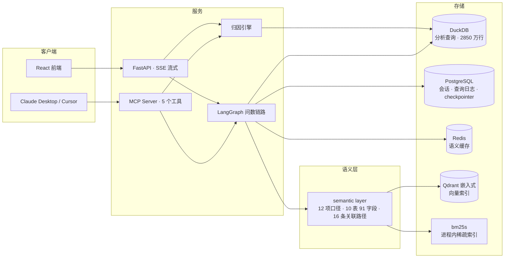
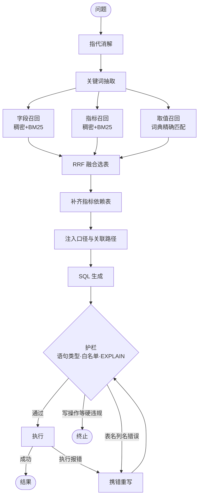
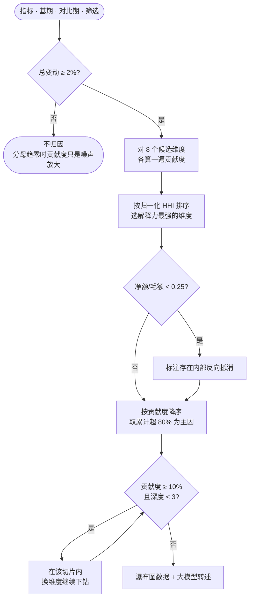

# 业务数据问数与归因智能体

面向品牌商渠道运营场景的数据智能体：业务人员用自然语言完成自助取数、
指标异动溯源与终端陈列稽核，不需要懂 SQL，也不需要记住十几个指标的口径差异。

```
自然语言问题  →  指代消解 → 混合检索 → 口径注入 → SQL 生成 → 安全校验 → 执行
                                                                  ↘ 失败携错重写
指标为何变动  →  多维贡献度分解 → 主因判定 → 递归下钻 → 定量结果转业务结论
```

## 为什么不是又一个 Text2SQL demo

三点区别，都有实测数字支撑：

**一、口径沉淀在 semantic layer，不靠模型推断。** 12 项渠道运营指标的计算式与
易错点写成配置，检索与 SQL 生成共用同一份定义。消融实验显示这一层贡献
**13.0 个百分点**（配对检验 p=0.003）——移除后复合指标类问题的准确率从 68% 跌到 **20%**。

**二、归因是确定性计算，大模型只做转述。** 贡献度按
`C_i = (V_i,t1 − V_i,t0) / (V_t1 − V_t0)` 精确分解，累计超 80% 判主因，
递归下钻三层。**按哪个维度拆解是算出来的**，不是指定的——引擎对 8 个候选维度
各算一遍解释集中度再选。40 组含随机波动的埋因场景定位准确率 **85%**。

**三、评测用配对检验判定显著性。** 单轮评测的题目级翻转可达 9 题，
n=100 时二项标准误就有 4 个百分点，比较均值判不出小于 8 个百分点的差异。
五组配置跑同一批题目，是配对样本，改用配对符号检验后功效大幅提高：
semantic layer p=0.003，而混合检索 7 胜 6 负、self-correction 6 胜 6 负，
**接近完美对称——不是样本量不够，是真的没有差异**。
所以本项目诚实地报告这两个模块无收益，而不是给三个漂亮的百分点。

## 评测结果

100 题四档难度测试集，execution accuracy（比对结果集而非 SQL 文本），
每组配置独立跑 3 轮取均值。完整报告见 [eval/REPORT.md](eval/REPORT.md)。

| 配置 | 准确率 | T1 基础聚合 | T2 多表关联 | T3 嵌套窗口 | T4 复合跨粒度 | 相对主方案 |
|---|---|---|---|---|---|---|
| **主方案（全链路）** | **81.3%** (79–83) | 97% | 93% | 67% | 68% | — |
| 基线：裸模型直连 schema | 67.3% (66–69) | 100% | 73% | 73% | **23%** | **−14.0**（p=0.007） |
| 消融：移除 semantic layer | 68.3% (68–69) | 100% | 96% | 57% | **20%** | **−13.0**（p=0.003） |
| 消融：仅稠密检索 | 82.3% (81–84) | 100% | 93% | 73% | 63% | +1.0（p=1.00，无差异） |
| 消融：移除 self-correction | 81.3% (80–82) | 99% | 92% | 64% | 71% | ±0.0（p=1.00，无差异） |

**semantic layer 是唯一测出显著贡献的模块**，且价值集中在 T4：主方案 68%，移除后 20%。
费效比、库存周转天数这类指标的口径本身就是答案的一部分——caveat 以可照抄的
SQL 片段注入，没有它模型会写出跨粒度 JOIN，跑得通、有数字、结果完全错。

而混合检索与 self-correction 未测出收益：在这个规模上 schema linking 不是瓶颈，
口径才是——检索的价值要到表数量上千、schema 塞不进上下文时才体现。

**一个仍未解释的反常**：T3 嵌套与窗口类，基线（73%）反而高于主方案（67%）。
主方案在其余三档全面领先，唯独这一档落后于裸模型。已排除「检索裁表引入多余
事实表」这一假设——修正选表逻辑后 T3 未发生变化。

### 主测试集量不到的两个维度

100 题全是单轮、且只量执行准确率——指代消解与 guardrail 这把尺子碰不到，
各补一套评测：

| 维度 | 结果 | 对照 |
|---|---|---|
| 多轮指代消解（20 组） | **75.0%** | 不传上下文的对照组 **5.0%** |
| guardrail 拦截（22 恶意 + 8 正常） | **漏网 0 条** | 正常查询**误伤 0 条** |

多轮那 70 个百分点是本项目所有消融中差距最大的一项。guardrail 侧两道防线分开
统计：护栏层拦截 14 条，模型在生成阶段就丢弃恶意片段 8 条。

其余关键指标：

| 项 | 实测 |
|---|---|
| 动销明细行数 | 28,539,582（全量构建 18 秒，库文件 0.23 GB） |
| 语义缓存 | 冷 1189ms → 热 5ms，同义改写命中 11/12 |
| 归因定位准确率 | 85.0%（单因 100% / 同维双因 75% / 跨维双因 62%） |
| 端到端延迟 | 中位 1097ms，P95 2514ms |

## 架构

### 系统组成



按负载分离存储：DuckDB 列存承分析查询，PostgreSQL 承高频小事务的应用状态，
Redis 承语义缓存。Qdrant 走嵌入式、稀疏检索用进程内 bm25s——
全栈常驻内存约 400 MB，8 GB 无 Docker 环境可跑。

### 问数链路（12 节点）



三路召回真并行（LangGraph fan-out / fan-in）。RRF 只用名次不用分数，
规避余弦相似度与 BM25 分数量纲不可比的问题，没有需要调错的超参。
纠错后重走护栏，不绕过安全检查；只读连接是引擎层的最后一道物理防线。

### 归因流程



## 快速开始

需要 macOS/Linux、Python 3.13（uv 管理）、Node 20+、Homebrew。

```bash
# 1. 依赖与服务
uv sync
brew install postgresql@16 redis && brew services start postgresql@16 && brew services start redis
createdb channel_agent

# 2. 配置 API Key
cp .env.example .env      # 填入 DEEPSEEK_API_KEY，视觉侧另需 DASHSCOPE_API_KEY

# 3. 环境自检（六项）
PYTHONPATH=. uv run python scripts/smoke_test.py

# 4. 构建数仓与索引（约 20 秒）
PYTHONPATH=. uv run python scripts/build_warehouse.py --scale 1.20
PYTHONPATH=. uv run python -c "from app.retrieval.indexer import build; print(build())"
PYTHONPATH=. uv run python scripts/validate_warehouse.py     # 14 条基准 SQL 校验

# 5. 起服务
./scripts/dev.sh          # http://localhost:8000
```

命令行直接用：

```bash
PYTHONPATH=. uv run python scripts/ask.py -v "华东区上个月各渠道的净销额"
PYTHONPATH=. uv run python scripts/attribute.py net_sales 2026-02 2026-06 --narrate
```

重跑评测：

```bash
PYTHONPATH=. uv run python scripts/run_eval.py --runs 3        # 问数，5 组配置
PYTHONPATH=. uv run python scripts/run_attribution_eval.py     # 归因，40 组埋因场景
PYTHONPATH=. uv run python scripts/write_report.py             # 生成 eval/REPORT.md
```

MCP 接入 Claude Desktop / Cursor 见 [docs/MCP接入.md](docs/MCP接入.md)。

## 技术栈

| 层 | 选型 | 理由 |
|---|---|---|
| 编排 | LangGraph | 图结构天然支持并行召回与条件回环；checkpointer 落 PostgreSQL 使多轮状态跨进程存活 |
| 模型 | DeepSeek-chat / Qwen3-VL | SQL 能力强、中文原生、成本低；视觉侧另配 |
| 分析存储 | DuckDB | OLAP 列存，2850 万行分组聚合 91ms，进程内无服务端 |
| 应用存储 | PostgreSQL | 高频小事务；DuckDB 单写者模型不适合并发写 |
| 缓存 | Redis + Qdrant | 值存储与相似判定分离 |
| 检索 | Qdrant 嵌入式 + bm25s | 语料仅百余条，起 Elasticsearch 服务端占 1GB 内存纯属浪费 |
| 向量化 | fastembed（ONNX） | 省掉 torch 的 1GB+ 常驻，这是 8GB 机器跑起全栈的前提 |
| 服务 | FastAPI + SSE + MCP | 逐节点流式推送；MCP 让外部客户端复用同一套口径与护栏 |
| 前端 | React + TypeScript | 瀑布图为手写内联 SVG，未引图表库 |

## 目录

```
app/
  agent/        LangGraph 状态、图、12 个节点
  attribution/  归因引擎、埋因场景、瀑布图与转述
  retrieval/    语料、索引、混合召回、查询指纹
  warehouse/    星型 DDL、数据生成器、只读执行层
  clients/      LLM、PostgreSQL、Redis 语义缓存、Qdrant 单例
  api/ mcp/     HTTP 服务与 MCP Server
conf/           metrics.yaml（12 项口径）· schema.yaml（表语义与关联路径）
eval/           100 题测试集、评测执行、REPORT.md
frontend/       React + TypeScript
docs/           开发问题记录、MCP 接入说明
scripts/        建仓、建索引、评测、问数、归因、启动
tests/          38 条回归测试
```

## 已知边界

- **归因只支持可加指标**（销额、销量、费用）。比率型指标不满足可加性，
  引擎直接拒绝而不是给出一个看似合理实则无意义的分解。
- **检索在当前规模上无信息增益**。10 张表 91 个字段的裸 schema 仅 1837 字符，
  模型看得见全部信息。保留检索是为可扩展性，不夸大其当前收益。
- **数据为合成**。按深度分销模型参数化生成，14 条基准 SQL 校验业务合理性，
  但不等同真实业务数据。
- **品牌与品类在本数据中一一对应**，导致这两个维度在归因中不可区分。
  已在评测判定中按切片等价处理，但更彻底的做法是让品牌跨品类。
- **陈列稽核（M5）尚未上线**，货架图上传接口返回 501。

开发过程中踩的坑与解法记录在 [docs/开发问题记录.md](docs/开发问题记录.md)，
按类型分八节，每条含现象、根因、解法与可复用的一般结论。
